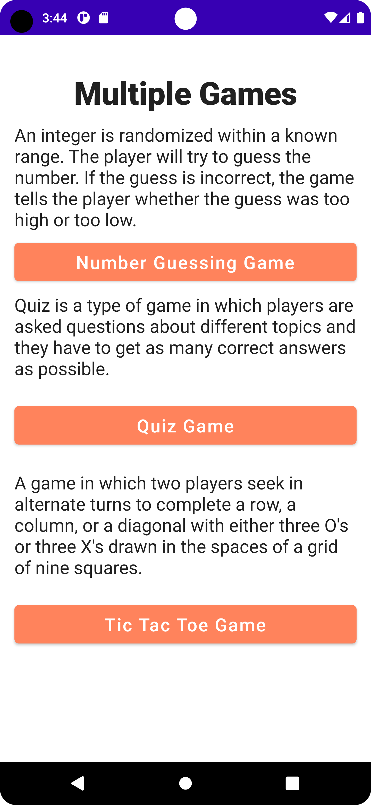

# CN333 Assignment 3

# List of contributors
#### Kantapon Makwong 6310520066
#### Sabina Llewellyn 6310610982
#### Pavisa Sirirojvorakul 6310620064

# Mobile Application function
There are 3 games in this app, Users can go back to Select other game with Select Game button or arrow back symbol on TopAppBar.
### 1. Number Guessing Game
- Users can enter a number in an input box.
- Users can only enter numbers in range of 1 to 1000 only.
- Users will receive hints if the number entered is too high or too low.
- Users will get a congratulations message and number of times guessed if the guessed number is correct.
- Users can replay the game by play again button.

### 2. Quiz Game 
- The questions of the quiz are randomized.
- The choices of the questions are randomized.
- Users will go through 10 questions and choose 1 answer at a time.
- Users can see their current score displayed at the top right corner of the app.
- Final score will be displayed at the end of the quiz.

### 3. Tic Tac Toe Game
- This game can be play by 2 users.
- We have 2 role of player, player "X" and player "O", Players take turns putting their marks in empty squares.
- The game is played on a grid that's 3 squares by 3 squares.
- The first player to get 3 of her marks in a row (up, down, across, or diagonally) is the winner.
- When all 9 squares are full, the game is over. If no player has 3 marks in a row, the game ends in a tie.
- Game will count times that each user win and number of tie game.

## Link to the video demonstration

LinkVideo = > [Click Here.](https://youtu.be/7TVEXZziDP8)

## Example Display QuizGame

### Main Screen of the App

### Number Guessing Game

### Quiz Game

### Tic Tac Toe Game

